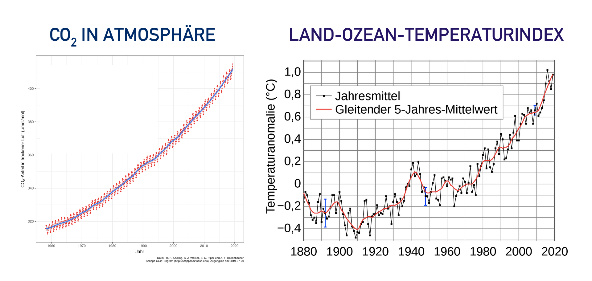
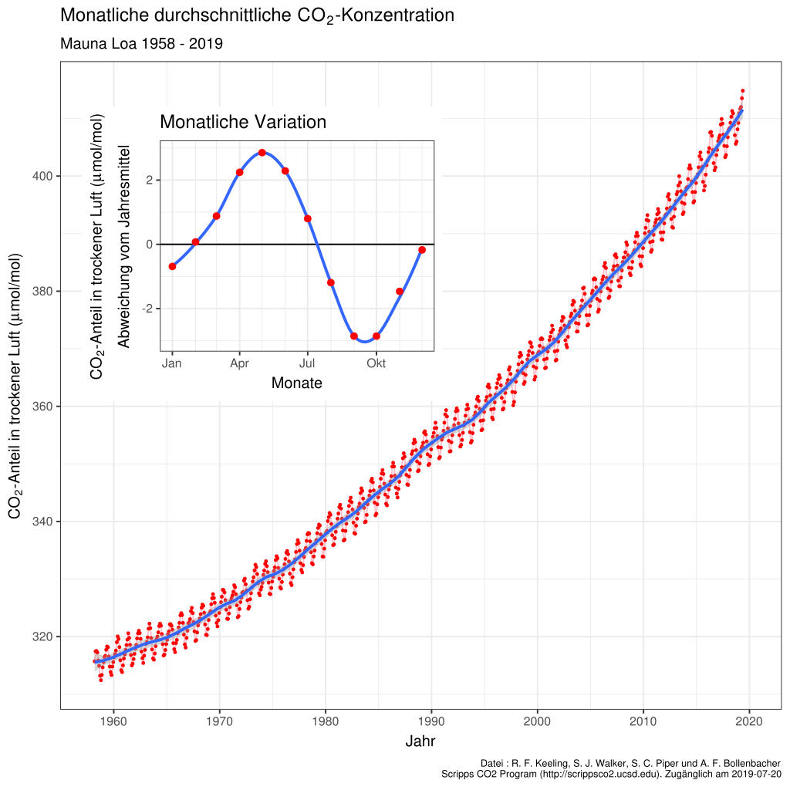
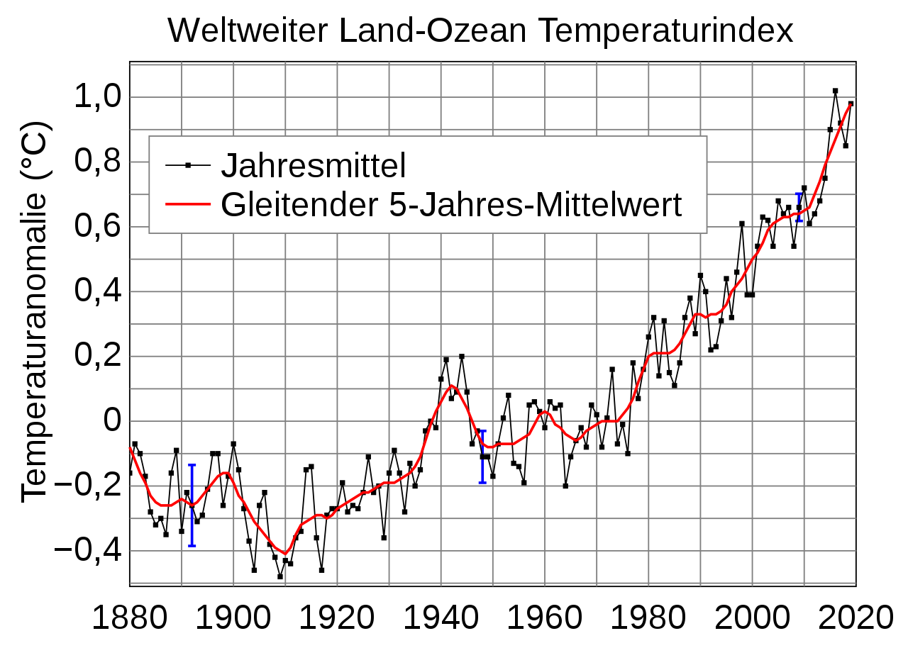
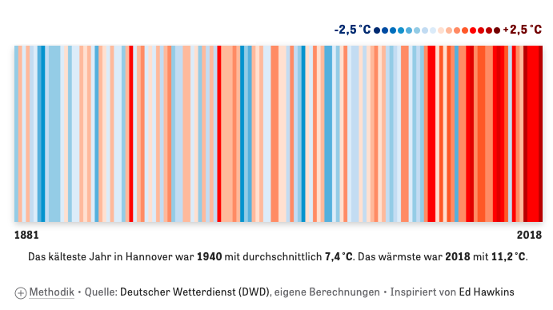
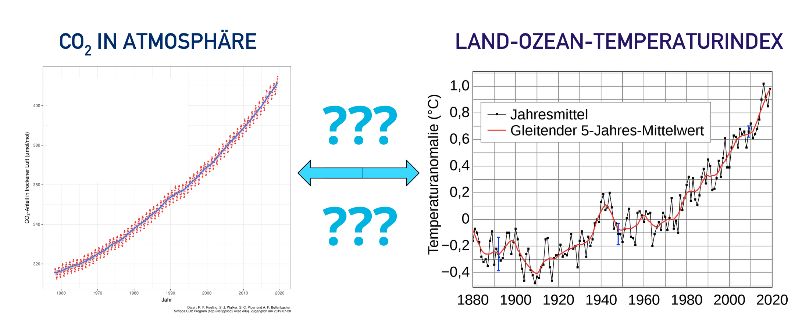
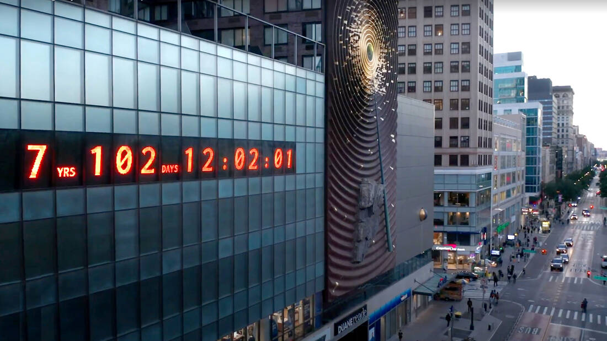

## Hey du, kurz mal Zeit für Klimakrise?

Ja, ich weiß. Eigentlich ist jetzt Feierabend, Mittagspause, Wochenende oder du sitzt gerade mit dem Smartphone auf Toilette. Und eigentlich willst du einfach mal den Kopf ausmachen. Schule, Ausbildung, Studium, Bewerbungen oder dein Job sind schon nervig genug und Spaß am Leben muss ja auch irgendwie drin sein. Und ja, der ganze Klimakram ist anscheinend kompliziert. Alle labern rum, tausend Zahlen und Meinungen kursieren, - anstrengend, richtig anstrengend! Wie so eine nie endende Politik-Talkshow, bei der sich niemand ausreden lässt. 🙅‍♂️

Aber hey! Wer Stories auf Instagram hinbekommt oder die Regeln vom Videobeweis in der Bundesliga im Detail diskutieren kann, der versteht auch den Klimakram und was zu tun ist. So kompliziert ist es nämlich gar nicht. 🍹 Also kühles Getränk aufmachen und weiterlesen:

## So, was ist wirklich wichtig?

Eigentlich muss die Menschheit nur zwei Diagramme im Auge behalten: "CO2-Konzentration in der Atmosphäre" und "Weltweiter Land-Ozean-Temperaturindex". Auf diese beiden Diagramme werden wir gleich näher eingehen (Keine Sorge, gleich gibt es das erste versprochene Video!)

Selbst erstellte Remix-Grafik, verwendete Werke: <a href="https://commons.wikimedia.org/wiki/User:Delorme">Delorme</a>, <a href="https://commons.wikimedia.org/wiki/File:Mauna_Loa_CO2_monthly_mean_concentration _DE.svg">Mauna Loa CO2 monthly mean concentration DE</a>, <a href="https://creativecommons.org/licenses/by-sa/4.0/legalcode">CC BY-SA 4.0</a>
  sowie NASA <a href="https://en.wikipedia.org/wiki/Goddard_Institute_for_Space_Studies">Goddard Institute for Space Studies</a>
  , <a href="https://commons.wikimedia.org/wiki/File:Global_Temperature_Anomaly.svg">Global Temperature Anomaly</a>
  , als gemeinfrei gekennzeichnet, Details auf <a href="https://commons.wikimedia.org/wiki/Template:PD-US">Wikimedia Commons</a>. Titel hinzugefügt/beschnitten, monatliche Variationsgrafik entfernt, nachnutzbar als <a href="https://creativecommons.org/licenses/by-sa/4.0/legalcode">CC BY-SA 4.0</a>.

### Diagramm 1: CO2 in der Atmosphäre

Das erste Messdiagramm (links) zeigt den aktuellen Anteil von Kohlenstoffdioxid, CO2, in der Atmosphäre unseres Planeten Erde an. Kohlenstoffdioxid, CO2, ist an sich ein natürliches Gas, welches unsichtbar und geruchlos ist und schon immer auf diesem Planeten zu finden war. Wir atmen es aus, Pflanzen können es aufnehmen und es entsteht auch bei der Verbrennung von Kohle oder Vulkanausbrüchen. Der Anteil von CO2 wird in parts per million (ppm) gemessen, die kleine Grafik oben links (monatliche Variation) musst du erstmal überhaupt nicht beachten:

 Grafik:
 <a rel="cc:attributionURL" property="dc:title" href="https://commons.wikimedia.org/wiki/File:Mauna_Loa_CO2_monthly_mean_concentration_DE.svg">Mauna Loa CO2 monthly mean concentration DE</a>
 von <a rel="cc:attributionURL dc:creator" href="https://commons.wikimedia.org/wiki/User:Delorme" property="cc:attributionName">Delorme</a>
 under
 <a rel="license" href="https://creativecommons.org/licenses/by-sa/4.0/legalcode">CC BY-SA 4.0</a>

Wie du siehst: Seit 1958 steigt der Wert der parts per million (ppm, linke Achse) ständig weiter. 2019 wurde (schon wieder) ein neuer Höchstwert, nämlich 415 parts per million, gemessen in der Erdatmosphäre (<a href="https://www.scinexx.de/news/geowissen/co2-werte-erreichen-neuen-rekordwert/" target="_blank">Quelle</a>). Gemessen wird die CO2-Konzentration täglich in der <a href="https://de.wikipedia.org/wiki/Messstation_Mauna_Loa">„Messstation Mauna Loa"</a> in Haiwaii, welche sich auf einem Vulkangipfel befindet und daher eine gute Lage für eine möglichst genaue Messung bietet. Aber Moment - kann man das wirklich so genau messen, wie viel Gas in unserer Atmosphäre rumschwirrt? Und was war denn vor 1958, wie viel CO2 war da in der Atmosphäre? 💡 Hier kurz mal aufpassen, die Birne einschalten und das Video bis zu Minute 3:40 schauen:

<iframe width="560" height="415" src="" data-2click-type="video" data-src="https://www.youtube-nocookie.com/embed/DdKhKxShJf0" frameborder="0" allow="accelerometer; autoplay; encrypted-media; gyroscope; picture-in-picture" allowfullscreen></iframe>

 Video:
 <a rel="cc:attributionURL" property="dc:title" href="https://www.daserste.de/information/nachrichten-wetter/wetter/videos/02_Jahresgang_der_CO2_Kurve-100.html">ARD/Wetter vor Acht</a>
 von <a rel="cc:attributionURL dc:creator" href="https://www.daserste.de" property="cc:attributionName">ARD</a>
 nicht unter freier Lizenz

 

Okay, das chemische Element Kohlenstoff (C) als auch das Gas Kohlenstoffdioxid (CO2) sind ja Teil der Natur, es gibt den natürlichen Kohlestoffkreislauf, der sowas regelt, also wo ist das Problem mit CO2? Alles an sich kein Ding, stimmt schon. Problematisch sind aber die großen (unnatürlichen) Mengen des Gases, die bei der Verbrennung von Kohle, Öl und Gas von uns Menschen, bspw. in der Industrie, beim Bauen, für das Heizen oder im Mobilitätssektor, rausgepustet werden. Schon früh hatten einige Wissenschaftler:innen daher die These, dass sich durch diese Mehr-Menge an CO2 der Planet Erde stark aufhitzen wird. Was uns zum zweiten Diagramm führt (Halte durch!):

### Diagramm 2: Temperaturabweichung über die Jahre

Das zweite Diagramm zeigt die durchschnittliche Abkühlung oder Erwärmung, wenn man alle Temperaturmessungen auf der Welt zusammenrechnet und noch so ein paar langweilige statistische Berechnungen macht. Im Grunde also ob es jeweils wärmer oder kälter wurde im Gesamtdurchschnitt pro Jahr und mit Blick auf die ganze Erdoberfläche gerechnet, daher auch Land-Ozean-Temperatur-Index. Gibt ja nicht nur Landfläche auf der Welt, sondern Meere machen ja auch viel aus:

 Grafik: NASA <a rel="cc:attributionURL" property="dc:title"  href="https://en.wikipedia.org/wiki/Goddard_Institute_for_Space_Studies">Goddard Institute for Space Studies</a>, <a href="https://commons.wikimedia.org/wiki/File:Global_Temperature_Anomaly.svg">Global Temperature	Anomaly</a>, als gemeinfrei gekennzeichnet, Details auf <a rel="license" href="https://commons.wikimedia.org/wiki/Template:PD-US">Wikimedia Commons</a>

Was sehen wir? Seit 1940 hat sich die Durchschnittstemperatur global gesehen also um ca. 1 Grad erhöht. Hört sich erstmal nicht viel an, hat aber schon ordentliche Konsequenzen (später gibt es dazu noch ein Video). Diese Temperaturabweichungen kann man natürlich ebenso für einzelne Länder, Regionen und Städte berechnen, hier z.B. die Abweichungen in Hannover (<i>„War die Temperatur in einem Jahr wärmer als die durchschnittliche Temperatur in diesem Zeitraum, färben wir den Streifen in Rottönen, war sie niedriger, in Blautönen.“ - Warming Stripes Tool von ZEIT Online, inspriert von Ed Hawkins</i>):

Screenshot: <a rel="cc:attributionURL" property="dc:title" href="https://www.zeit.de/wissen/umwelt/2019-12/klimawandel-globale-erwaermung-warming-stripes-wohnort">Warming Stripes Tool von ZEIT Online</a>, Screenshot nicht unter freier Lizenz

Wir sehen: Es wurde (durchschnittlich) deutlich wärmer in den letzten Jahren, sowohl global gerechnet als auch in Hannover, was ja irgendwie so halbwegs mittig in Deutschland liegt. 😉 Auch in <a href="https://nachhaltig-in-graz.at/showyourstripes-warming-stripes/" target="_blabk">Österreich</a> sowie der Schweiz sieht der Streifen ähnlich aus. Auf <a href="https://showyourstripes.info/" target="_blank">showyourstripes.info</a> kann man alle Regionen der Erde durchgehen, auch hier: links viel blau, rechts dann viel rot. Alle, die es eilig haben, können sich auch einfach das folgende NASA-Video (30 Sekunden) anschauen und dann weiterscrollen:

<iframe width="560" height="415" src="" data-2click-type="video" data-src="https://www.youtube-nocookie.com/embed/3sqdyEpklFU" frameborder="0" allow="accelerometer; autoplay; encrypted-media; gyroscope; picture-in-picture" allowfullscreen></iframe>

<a rel="attributionURL" property="dc:creator" href="https://www.youtube.com/watch?v=3sqdyEpklFU">NASA Climate Change: Global Temperature Anomalies from 1880 to 2019</a>, Lizenz/Freigabe unklar

🤔 Wir halten fest: Mehr CO2 in der Atmosphäre (erstes Diagramm), im Durchschnitt wird es wärmer (zweites Diagramm). Und was heißt das jetzt?! Dazu kommen wir jetzt. Noch ein bisschen Text, zwei kurze Videos, dann sind wir durch.  Also mach dir mal noch das zweite Kaltgetränk auf und ab in den Endspurt:

### Warum steigen beide Werte (CO2, Temperatur)?

Wären die CO2-Konzentration sowie die durchschnittliche Temperatur die Kurse von Aktien, die wir gekauft haben, wäre es jetzt Zeit für den Champagner. Stetig steigend, großartig! 🍾🥂 Leider geht es aber um die Natur auf unserem Planeten, da heißen steigende Kurven in Diagrammen nicht immer etwas Gutes.

Gibt es nun also einen direkten Zusammenhang zwischen CO2-Konzentration und durchschnittlicher Temperatur auf dem Planeten?

Eigene Zusammenstellung, <a href="https://creativecommons.org/licenses/by-sa/4.0/legalcode" rel="license">CC BY-ShareAlike 4.0</a>, verwendete Bilder: Grafik: <a href="https://commons.wikimedia.org/wiki/User:Delorme">Delorme</a>, <a href="https://commons.wikimedia.org/wiki/File:Mauna_Loa_CO2_monthly_mean_concentration_DE.svg">Mauna Loa CO2 monthly mean concentration DE</a>, <a href="https://creativecommons.org/licenses/by-sa/4.0/legalcode" rel="license">CC BY-SA	4.0</a> und NASA <a href="https://en.wikipedia.org/wiki/Goddard_Institute_for_Space_Studies">Goddard Institute for Space Studies</a>, <a href="https://commons.wikimedia.org/wiki/File:Global_Temperature_Anomaly.svg">Global Temperature Anomaly</a>, als gemeinfrei gekennzeichnet, Details auf <a href="https://commons.wikimedia.org/wiki/Template:PD-US">Wikimedia Commons</a>

Vorsicht: In der Welt der Statistik gibt es auch sogenannte <i>Scheinkorrelationen</i> bzw. Scheinkausalitäten</i>. Eine solche kann vorliegen, wenn man zwei Diagramme hat und beide zusammenzuhängen scheinen, in Wirklichkeit beeinflusst aber eine dritte Variable die Situation. Ein schönes Beispiel findet sich <a href="https://welt-der-bwl.de/Scheinkorrelation" target="_blank">hier</a> bzgl. Eisdielen-Umsatz und Herz-Kreislauf-Problemen [sowie der dritten Variable Temperatur]).

Also Butter bei die Fische: Gibt es einen Zusammenhang zwischen CO2 in der Atmosphäre und den Temperaturen oder nicht? Noch mal kurz alle Konzentration sammeln und das folgende 3,5-Minuten-Video komplett durchhalten, welches das Zusammenspiel von CO2 und Temperatur auf der Erde erklärt (Du schaffst das! 💪):

<iframe src="" data-2click-type="video" data-src="https://commons.wikimedia.org/wiki/File:Wie_CO2_dem_Klimawandel_verursacht.webm?embedplayer=yes" width="512" height="415" frameborder="0"></iframe>

Video: <a rel="cc:attributionURL" href="https://commons.wikimedia.org/wiki/File:Wie_CO2_dem_Klimawandel_verursacht.webm?embedplayer=yes" property="dc:title">ZDF/Terra X/Gruppe 5/Luise Wagner, Jonas Sichert, Andreas Hougardy - Wie CO2 den Klimawandel verursacht</a>, <a rel="license" href="https://creativecommons.org/licenses/by/4.0/deed.de">CC BY 4.0</a> (via <a href="https://commons.wikimedia.org/wiki/File:Wie_CO2_dem_Klimawandel_verursacht.webm?uselang=de#filelinks">Wikimedia Commons</a>)

Okay, Treibhauseffekt, klingt langweilig, aber gecheckt - grobe Daumenregel: Mehr CO2 in Atmosphäre = stärkerer Treibhauseffekt = steigende Temperaturen = Erde, Mensch, Tier und Ökosysteme schwitzen und sind unter Stress 🥵🔥 Einige Tierarten versuchen daher bereits in kältere Regionen zu flüchten (<a href="https://futurezone.at/science/massenflucht-von-tieren-an-die-pole-hat-begonnen/400928198" target="_blank">Massenflucht von Tieren an die Pole hat begonnen</a>). Mehr zum wissenschaftlichen Nachweis des Zusammenhangs findet sich übrigens u.a. auf klimafakten.de (<a href="https://www.klimafakten.de/behauptungen/behauptung-der-co2-anstieg-ist-nicht-ursache-sondern-folge-des-klimawandels" target="_blank">"Ist vielleicht etwas anderes als der Mensch die Ursache?"</a>).

#### Fazit

Wir halten also zum Abschluss fest (ganz kurz noch durchhalten und dranbleiben!): Der Planet Erde hat sich durchschnittlich schon um 1 Grad erwärmt, Auslöser sind zum größten Teil wir Menschen.

„Okay“”, wirst du vielleicht sagen, „ein bisschen höhere Temperaturen im Sommer kriegen wir ja auch mit Klimananlagen in Mitteleuropa irgendwie geregelt?  Geht ja in anderen Ländern auch problemlos? Lebewesen und Ökosysteme passen sich an, Stichwort Evolution?“

Nunjaaaaa... Die Szenarien über 1,5 Grad sehen eher so aus, dass Klimaanlagen allein nicht reichen werden - siehe dieses letzte Video:

<iframe width="560" height="415" src="" data-2click-type="video" data-src="https://www.youtube-nocookie.com/embed/FoMzyF_B7Bg" frameborder="0" allow="accelerometer; autoplay; encrypted-media; gyroscope; picture-in-picture" allowfullscreen></iframe>

Video:
<a rel="cc:attributionURL" property="dc:title" href="https://www1.wdr.de/mediathek/video/sendungen/quarks-und-co/video-szenarien-der-erderwaermung-was-waere-wenn--100.html">Quarks 19.03.2019/WDR/Daniel Haase</a>, nicht unter freier Lizenz

Die Menschheit muss an sich also "nur" schauen, dass das globale Thermometer nicht weiter steigt und daher muss der Treibhausgas/CO2-Ausstoß massiv reduziert werden. Ist keine Raketenwissenschaft, oder?

Glückwunsch, dass du dich hier durch gekämpft hast!

~

#### Und nun?

Ich würde hier gerne mit der guten Nachricht abschließen, dass noch voll viel Zeit bleibt. Aber Greta Thunberg sprach nicht ohne Grund von „I want you to panic“. Laut Klimaforscher:innen wie Hans Joachim Schellnhuber haben wir, die Menschheit, in Sachen Klimaschutz viel zu lange viel zu wenig getan. Eigentlich vergleichbar mit dem Lernen vor Klausuren oder dem Abgabetermin einer Hausarbeit - wir chillen viel zu lange und dann wird es extrem stressig. Schellnhuber sagte kürzlich [Quelle: <a href="https://twitter.com/Jumpsteady/status/1309979685565194240" target="_blank">DIE ZEIT Nr. 40/2020 24.09.2020, via @Jumpsteady</a>]:

<blockquote>„Mein Problem ist nicht die Übertreibung. Beim Klima ist eigentlich alles, was schiefgehen konnte, schiefgegangen. Schauen Sie sich einfach die Emissionskurve an, das ist ein Faktum: Die geht nach oben und oben. Mein Problem ist inzwischen eher die Untertreibung. Eigentlich endet jedes Interview mit der Frage: Haben Sie noch Hoffnung? Nee, eigentlich nicht mehr. Aber wenn Sie mich wirklich lange genug quälen, sage ich Ihnen: Die Wahrscheinlichkeit, das Pariser Abkommen noch umzusetzen, liegt vielleicht bei zehn Prozent.“</blockquote>

Es bleibt für die Schadensbegrenzung und das Stoppen der Erwärmung des Planeten nur noch ein kleiner Spielraum übrig. Sofortiges Handeln ist unbedingt nötig. Als öffentliche Erinnerung wurde in New York bspw. eine "Klima-Uhr" installiert, die anzeigt wie viel Jahre noch bleiben, bis die Menschheit keine Emissionen mehr in die Atmosphäre entlassen darf. (Weil das errechnete CO2-Budget für die maximale Erwärmung vom Pariser Klimaziel 1,5 Grad dann aufgebraucht ist). Diese Uhr steht derzeit bei knapp über 7 Jahren, also 2027 (Stand 27.09.2020):

Foto: <a href="https://climateclock.world/">climateclock.world-Projekt</a>, nicht unter freier Lizenz

Klingt alles düster? Ist es. Aber die Menschheit hat wahnsinnig krasse Dinge geschafft, Atomkriege verhindert, das Ozonloch geschlossen, die Sklaverei verboten, Menschenrechte und Gleichberechtigung etabliert, ist in den Weltall geflogen, hat technologisch und sozial wahnsinnige Fortschritte gemacht, stets dazu gelernt und sich immer wieder neu hinterfragt und neu erfunden mit jeder Generation. Und so verkündet auch Luisa Neubauer von Fridays For Future, auch weiterhin nicht locker zu lassen:

<iframe width="560" height="415" src="" data-2click-type="video" data-src="https://www.youtube-nocookie.com/embed/TatxwaWQaFs" frameborder="0" allow="accelerometer; autoplay; encrypted-media; gyroscope; picture-in-picture" allowfullscreen></iframe>

Video:
<a href="https://www.youtube.com/watch?v=TatxwaWQaFs&feature=emb_title">Rede von Luisa Neubauer bei Fridays-For-Future Demo vor Brandenburger Tor in Berlin 25.09.2020, Phoenix</a>, nicht unter freier Lizenz

#### Handlungsmöglichkeiten

Was du sofort tun kannst? Bleibe informiert, bilde dich selbst weiter, unterstütze Initiativen, mach Druck auf Politik und Entscheidungsträger:innen, triff möglichst bewusste Konsum- und Alltagsentscheidungen, check deine finanziellen Handlungsmöglichkeiten (nachhaltiges Bankkonto, Stromanbieter, etc.); misch dich ein, wenn es deine persönlichen Ressourcen zulassen.

Informiert bleiben kannst du zum Beispiel über folgende Kanäle:

**Instagram**: [Greta Thunberg](https://www.instagram.com/gretathunberg/?hl=de), [Luisa Neubauer](https://www.instagram.com/luisaneubauer/?hl=de), [Leonie  Bremer](https://www.instagram.com/leoniebremr/?hl=de), [FridaysForFutureDE](https://www.instagram.com/fridaysforfuture.de/?hl=de), [GermanZero](https://www.instagram.com/_germanzero/?hl=de), [FridaysForFutureAT](https://www.instagram.com/fridaysforfuture.at/?hl=de), [FridaysForFutureCH](https://www.instagram.com/fridaysforfuture.ch/?hl=de), [NachhaltigKritisch](https://www.instagram.com/nachhaltig.kritisch/?hl=de), [Der Graslutscher](https://www.instagram.com/dergraslutscher/) **Twitter**: [KlimaVorAcht](https://twitter.com/klimavoracht), [Jumpsteady](https://twitter.com/Jumpsteady), [Maja Göpel](https://twitter.com/beyond_ideology?lang=de), [She Drives Mobility](https://twitter.com/kkklawitter), [Özden Terli](https://twitter.com/TerliWetter), [Rico Grimm](https://twitter.com/gri_mm?lang=de) // **YouTube**: [Scientists For Future](https://www.youtube.com/channel/UCTYJGqonRI35naHC2L6lRGw), [MaiLab](https://www.youtube.com/watch?v=4K2Pm82lBi8) // & viele, viele mehr.

Einen längeren Vortrag zum Thema Klimakrise findest du u.a. hier:

▶️ <a href="https://www.youtube.com/watch?v=esF6bl2H5x0&feature=youtu.be" target="_blank">Will Steffen - Die große Wende voraus</a> 
<small>Warum ist 2020 ein entscheidendes Jahr in der #Klimakrise? Die #GroßeWendeVoraus gibt Antworten darauf. Ein beeindruckender Filmvortrag von Professor Will Steffen über die Tragweite und Dringlichkeit des #Klimawandels.</small>

Tipps für die mentale Gesundheit in Zeiten der Klimakrise: <a href="https://www.instagram.com/klimaangst/?hl=de" target="_blank">KlimaAngst @ Instagram</a>

To be continued, danke für die Aufmerksamkeit!

~

⚠️ Dieser Artikel wurde noch nicht von fachkundigen Personen gefeedbacked, ggf. können noch inhaltliche Fehler enthalten sein. Feedback ist gerne gesehen! 👉 [Insta-DM](https://www.instagram.com/matze_schnelldurchlauf/), [Twitter-DM](https://www.twitter.com/m_andrasch), E-Mail: anfragen@matthias-andrasch.de. 
