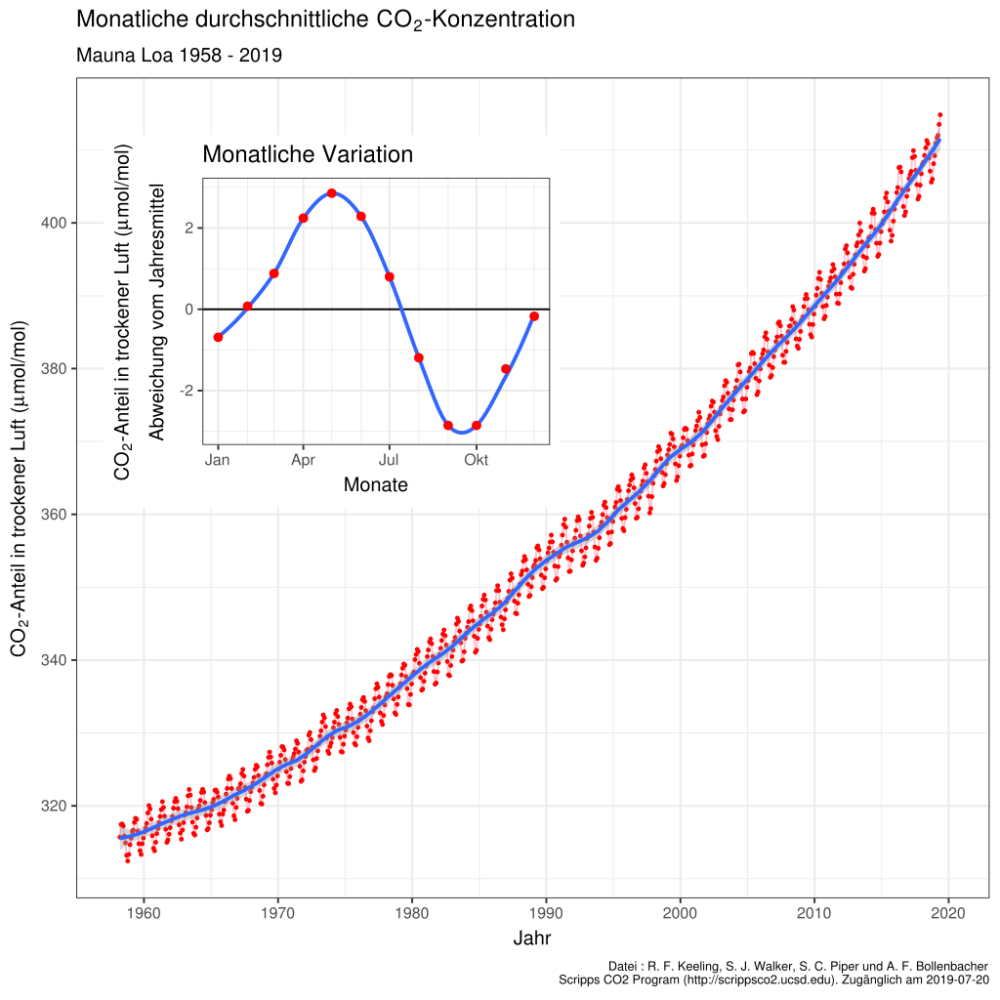

### Hey du, kurz mal Zeit für Klimakrise?

Ja, ich weiß. Eigentlich ist jetzt Feierabend / Mittagspause / Wochenende (oder du sitzt gerade auf dem Klo mit Smartphone). Und eigentlich willst du einfach mal den Kopf ausmachen. Schule / Ausbildung / Studium / Bewerbungen oder dein Job sind schon nervig genug und Spaß am Leben muss ja auch irgendwie drin sein auf diesem Planeten. Und ja, der ganze Klimakram ist anscheinend kompliziert. Alle labern rum, tausend Zahlen und Meinungen kursieren, - anstrengend, richtig anstrengend! Wie so eine nie endende Politik-Talkshow, bei der sich niemand ausreden lässt. 🙅‍♂️ 
Aber hey! Wer Stories auf Instagram hinbekommt oder die Regeln vom Videobeweis in der Bundesliga im Detail diskutieren kann, der versteht auch den Klimakram und was zu tun ist. So kompliziert ist es nämlich gar nicht. 🍹 Also kühles Getränk aufmachen und weiterlesen:

### So, was ist wirklich wichtig?

Eigentlich muss die Menschheit nur zwei Diagramme im Auge behalten: "CO2-Konzentration in der Atmosphäre" und "Weltweiter Land-Ozean-Temperaturindex". Auf diese beiden Diagramme werden wir gleich näher eingehen (Keine Sorge, gleich gibt es das erste versprochene Video!)

Selbst erstellte Remix-Grafik, verwendete Werke: <a href="https://commons.wikimedia.org/wiki/User:Delorme">Delorme</a>, <a href="https://commons.wikimedia.org/wiki/File:Mauna_Loa_CO2_monthly_mean_concentration _DE.svg">Mauna Loa CO2 monthly mean concentration DE</a>, <a href="https://creativecommons.org/licenses/by-sa/4.0/legalcode">CC BY-SA 4.0</a>
  sowie NASA <a href="https://en.wikipedia.org/wiki/Goddard_Institute_for_Space_Studies">Goddard Institute for Space Studies</a>
  , <a href="https://commons.wikimedia.org/wiki/File:Global_Temperature_Anomaly.svg">Global Temperature Anomaly</a>
  , als gemeinfrei gekennzeichnet, Details auf <a href="https://commons.wikimedia.org/wiki/Template:PD-US">Wikimedia Commons</a>. Titel hinzugefügt/beschnitten,  nachnutzbar als <a href="https://creativecommons.org/licenses/by-sa/4.0/legalcode">CC BY-SA 4.0</a>.

### Diagramm 1: CO2 in der Atmosphäre

Das erste Messdiagramm (Mitte) zeigt den aktuellen Anteil von Kohlenstoffdioxid, CO2, in der Atmosphäre unseres Planeten Erde an. Kohlenstoffdioxid, CO2, ist an sich ein natürliches Gas, welches unsichtbar und geruchlos ist und schon immer auf diesem Planeten zu finden war. Wir atmen es aus, Pflanzen können es aufnehmen und es entsteht auch bei der Verbrennung von Kohle oder Vulkanausbrüchen. Der Anteil von CO2 wird in parts per million (ppm) gemessen, die kleine Grafik oben links (monatliche Variation) musst du erstmal überhaupt nicht beachten:

 Grafik:
 <a rel="cc:attributionURL" property="dc:title" href="https://commons.wikimedia.org/wiki/File:Mauna_Loa_CO2_monthly_mean_concentration_DE.svg">Mauna Loa CO2 monthly mean concentration DE</a>
 von <a rel="cc:attributionURL dc:creator" href="https://commons.wikimedia.org/wiki/User:Delorme" property="cc:attributionName">Delorme</a>
 under
 <a rel="license" href="https://creativecommons.org/licenses/by-sa/4.0/legalcode">CC BY-SA 4.0</a>

Wie du siehst: Seit 1958 steigt der Wert der parts per million (ppm, linke Achse) ständig weiter. 2019 wurde (schon wieder) ein neuer Höchstwert, nämlich 415 parts per million, gemessen in der Erdatmosphäre (<a href="https://www.scinexx.de/news/geowissen/co2-werte-erreichen-neuen-rekordwert/" target="_blank">Quelle</a>). Gemessen wird die CO2-Konzentration täglich in der <a href="https://de.wikipedia.org/wiki/Messstation_Mauna_Loa">„Messstation Mauna Loa"</a> in Haiwaii, welche sich auf einem Vulkangipfel befindet und daher eine gute Lage für eine möglichst genaue Messung bietet. Aber Moment - kann man das wirklich so genau messen, wie viel Gas in unserer Atmosphäre rumschwirrt? Und was war denn vor 1958, wie viel CO2 war da in der Atmosphäre? 💡 Hier kurz mal aufpassen, die Birne einschalten und das Video bis zu Minute 3:40 schauen:

<iframe width="560" height="415" src="https://www.youtube-nocookie.com/embed/DdKhKxShJf0" frameborder="0" allow="accelerometer; autoplay; encrypted-media; gyroscope; picture-in-picture" allowfullscreen></iframe>

 Video:
 <a rel="cc:attributionURL" property="dc:title" href="https://www.daserste.de/information/nachrichten-wetter/wetter/videos/02_Jahresgang_der_CO2_Kurve-100.html">ARD/Wetter vor Acht</a>
 von <a rel="cc:attributionURL dc:creator" href="https://www.daserste.de" property="cc:attributionName">ARD</a>
 nicht unter freier Lizenz

 

Okay, das chemische Element Kohlenstoff (C) als auch das Gas Kohlenstoffdioxid (CO2) sind ja Teil der Natur, es gibt den natürlichen Kohlestoffkreislauf, der sowas regelt, also wo ist das Problem mit CO2? Alles an sich kein Ding, stimmt schon. Problematisch sind aber die großen (unnatürlichen) Mengen des Gases, die bei der Verbrennung von Kohle, Öl und Gas von uns Menschen, bspw. in der Industrie, beim Bauen, für das Heizen oder im Mobilitätssektor, rausgepustet werden. Schon früh hatten einige Wissenschaftler:innen daher die These, dass sich durch diese Mehr-Menge an CO2 der Planet Erde stark aufhitzen wird. Was uns zum zweiten Diagramm führt (Halte durch!):

### Diagramm 2: Temperaturabweichung über die Jahre

Das zweite Diagramm zeigt die durchschnittliche Abkühlung oder Erwärmung, wenn man alle Temperaturmessungen auf der Welt zusammenrechnet und noch so ein paar langweilige statistische Berechnungen macht. Im Grunde also ob es jeweils wärmer oder kälter wurde im Gesamtdurchschnitt pro Jahr und mit Blick auf die ganze Erdoberfläche gerechnet, daher auch Land-Ozean-Temperatur-Index. Gibt ja nicht nur Landfläche auf der Welt, sondern Meere machen ja auch viel aus:

 Grafik: NASA <a rel="cc:attributionURL" property="dc:title"  href="https://en.wikipedia.org/wiki/Goddard_Institute_for_Space_Studies">Goddard Institute for Space Studies</a>, <a href="https://commons.wikimedia.org/wiki/File:Global_Temperature_Anomaly.svg">Global Temperature	Anomaly</a>, als gemeinfrei gekennzeichnet, Details auf <a rel="license" href="https://commons.wikimedia.org/wiki/Template:PD-US">Wikimedia Commons</a>

Was sehen wir? Seit 1940 hat sich die Durchschnittstemperatur global gesehen also um ca. 1 Grad erhöht. Hört sich erstmal nicht viel an, hat aber schon ordentliche Konsequenzen (später gibt es dazu noch ein Video). Diese Temperaturabweichungen kann man natürlich ebenso für einzelne Länder, Regionen und Städte berechnen, hier z.B. die Abweichungen in Hannover (<i>„War die Temperatur in einem Jahr wärmer als die durchschnittliche Temperatur in diesem Zeitraum, färben wir den Streifen in Rottönen, war sie niedriger, in Blautönen.“ - Warming Stripes Tool von ZEIT Online, inspriert von Ed Hawkins</i>):

Screenshot: <a rel="cc:attributionURL" property="dc:title" href="https://www.zeit.de/wissen/umwelt/2019-12/klimawandel-globale-erwaermung-warming-stripes-wohnort">Warming Stripes Tool von ZEIT Online</a>, Screenshot nicht unter freier Lizenz

Wir sehen: Es wurde (durchschnittlich) deutlich wärmer in den letzten Jahren, sowohl global gerechnet als auch in Hannover, was ja irgendwie so halbwegs mittig in Deutschland liegt. 😉 Auch in <a href="https://nachhaltig-in-graz.at/showyourstripes-warming-stripes/" target="_blabk">Österreich</a> sowie der Schweiz sieht der Streifen ähnlich aus. Auf <a href="https://showyourstripes.info/" target="_blank">showyourstripes.info</a> kann man alle Regionen der Erde durchgehen, auch hier: links viel blau, rechts dann viel rot. Alle, die es eilig haben, können sich auch einfach das folgende NASA-Video (30 Sekunden) anschauen und dann weiterscrollen:

<iframe width="560" height="415" src="https://www.youtube-nocookie.com/embed/3sqdyEpklFU" frameborder="0" allow="accelerometer; autoplay; encrypted-media; gyroscope; picture-in-picture" allowfullscreen></iframe>

<a rel="attributionURL" property="dc:creator" href="https://www.youtube.com/watch?v=3sqdyEpklFU">NASA Climate Change: Global Temperature Anomalies from 1880 to 2019</a>, Lizenz/Freigabe unklar

🤔 Wir halten fest: Mehr CO2 in der Atmosphäre (erstes Diagramm), im Durchschnitt wird es wärmer (zweites Diagramm). Und was heißt das jetzt?! Dazu kommen wir jetzt. Noch ein bisschen Text, zwei kurze Videos, dann sind wir durch.  Also mach dir mal noch das zweite Kaltgetränk auf und ab in den Endspurt:

### Warum steigen beide Werte (CO2, Temperatur)?

Wären die CO2-Konzentration sowie die durchschnittliche Temperatur die Kurse von Aktien, die wir gekauft haben, wäre es jetzt Zeit für den Champagner. Stetig steigend, großartig! 🍾🥂 Leider geht es aber um die Natur auf unserem Planeten, da heißen steigende Kurven in Diagrammen nicht immer etwas Gutes.

Gibt es nun also einen direkten Zusammenhang zwischen CO2-Konzentration und durchschnittlicher Temperatur auf dem Planeten?

Eigene Zusammenstellung, <a href="https://creativecommons.org/licenses/by-sa/4.0/legalcode" rel="license">CC BY-ShareAlike 4.0</a>, verwendete Bilder: Grafik: <a href="https://commons.wikimedia.org/wiki/User:Delorme">Delorme</a>, <a href="https://commons.wikimedia.org/wiki/File:Mauna_Loa_CO2_monthly_mean_concentration_DE.svg">Mauna Loa CO2 monthly mean concentration DE</a>, <a href="https://creativecommons.org/licenses/by-sa/4.0/legalcode" rel="license">CC BY-SA	4.0</a> und NASA <a href="https://en.wikipedia.org/wiki/Goddard_Institute_for_Space_Studies">Goddard Institute for Space Studies</a>, <a href="https://commons.wikimedia.org/wiki/File:Global_Temperature_Anomaly.svg">Global Temperature Anomaly</a>, als gemeinfrei gekennzeichnet, Details auf <a href="https://commons.wikimedia.org/wiki/Template:PD-US">Wikimedia Commons</a>

Vorsicht: In der Welt der Statistik gibt es auch sogenannte <i>Scheinkorrelationen</i> bzw. Scheinkausalitäten</i>. Eine solche kann vorliegen, wenn man zwei Diagramme hat und beide zusammenzuhängen scheinen, in Wirklichkeit beeinflusst aber eine dritte Variable die Situation. Ein schönes Beispiel findet sich <a href="https://welt-der-bwl.de/Scheinkorrelation" target="_blank">hier</a> bzgl. Eisdielen-Umsatz und Herz-Kreislauf-Problemen [sowie der dritten Variable Temperatur]).

Also Butter bei die Fische: Gibt es einen Zusammenhang zwischen CO2 in der Atmosphäre und den Temperaturen oder nicht? Noch mal kurz alle Konzentration sammeln und das folgende 3,5-Minuten-Video komplett durchhalten, welches das Zusammenspiel von CO2 und Temperatur auf der Erde erklärt (Du schaffst das! 💪):

<iframe src="https://commons.wikimedia.org/wiki/File:Wie_CO2_dem_Klimawandel_verursacht.webm?embedplayer=yes" width="512" height="415" frameborder="0"></iframe>

Video: <a rel="cc:attributionURL" href="https://commons.wikimedia.org/wiki/File:Wie_CO2_dem_Klimawandel_verursacht.webm?embedplayer=yes" property="dc:title">ZDF/Terra X/Gruppe 5/Luise Wagner, Jonas Sichert, Andreas Hougardy - Wie CO2 den Klimawandel verursacht</a>, <a rel="license" href="https://creativecommons.org/licenses/by/4.0/deed.de">CC BY 4.0</a> (via <a href="https://commons.wikimedia.org/wiki/File:Wie_CO2_dem_Klimawandel_verursacht.webm?uselang=de#filelinks">Wikimedia Commons</a>)

Okay, Treibhauseffekt, klingt langweilig, aber gecheckt - grobe Daumenregel: Mehr CO2 in Atmosphäre = stärkerer Treibhauseffekt = steigende Temperaturen = Erde, Mensch, Tier und Ökosysteme schwitzen und sind unter Stress 🥵🔥 Einige Tierarten versuchen daher bereits in kältere Regionen zu flüchten (<a href="https://futurezone.at/science/massenflucht-von-tieren-an-die-pole-hat-begonnen/400928198" target="_blank">Massenflucht von Tieren an die Pole hat begonnen</a>). Mehr zum wissenschaftlichen Nachweis des Zusammenhangs findet sich übrigens u.a. auf klimafakten.de (<a href="https://www.klimafakten.de/behauptungen/behauptung-der-co2-anstieg-ist-nicht-ursache-sondern-folge-des-klimawandels" target="_blank">"Ist vielleicht etwas anderes als der Mensch die Ursache?"</a>).

#### Fazit?

Wir halten also zum Abschluss fest (ganz kurz noch durchhalten und dranbleiben!): Der Planet Erde hat sich durchschnittlich schon um 1 Grad erwärmt, Auslöser sind zum größten Teil wir Menschen.

„Okay“”, wirst du vielleicht sagen, „ein bisschen höhere Temperaturen im Sommer kriegen wir ja auch mit Klimananlagen in Mitteleuropa irgendwie geregelt?  Geht ja in anderen Ländern auch problemlos? Lebewesen und Ökosysteme passen sich an, Stichwort Evolution?“

Nunjaaaaa... Die Szenarien über 1,5 Grad sehen eher so aus, dass Klimaanlagen allein nicht reichen werden - siehe dieses letzte Video:

<iframe width="560" height="415" src="https://www.youtube-nocookie.com/embed/FoMzyF_B7Bg" frameborder="0" allow="accelerometer; autoplay; encrypted-media; gyroscope; picture-in-picture" allowfullscreen></iframe>

Video:
<a rel="cc:attributionURL" property="dc:title" href="https://www1.wdr.de/mediathek/video/sendungen/quarks-und-co/video-szenarien-der-erderwaermung-was-waere-wenn--100.html">Quarks 19.03.2019/WDR/Daniel Haase</a>, nicht unter freier Lizenz

Die Menschheit muss an sich also "nur" schauen, dass das globale Thermometer nicht weiter steigt und daher muss der CO2-Ausstoß massiv reduziert werden. Ist keine Raketenwissenschaft, oder? Weiter unten gibt es jetzt noch Handlungsoptionen und mehr Videos und Infos.

THE END.

 <!-- eo # mainArticleContentForScrollProgress -->

### Bonus: Act now?

Was also tun, um die Erhitzung des Planeten zu stoppen und die krassesten Szenarien zu verhindern? Wissenschaftler:innen warnen seit Jahrzehnten und liefern immer neue Belege für die katastrophale Gesamtlage. Schon länger haben sich Politiker:innen daher international eigentlich geeinigt, die Erwärmung auf maximal 2 Grad gemeinsam zu begrenzen (<a href="https://www.youtube.com/watch?v=wQAXB9InW3M">Pariser Klimaziele/Pariser Klimaakommen</a>). Große und messbare Erfolge gibt es seitdem aber nicht wirklich, sagt z.B. die Schüler:innen-Bewegung <a href="https://fridaysforfuture.de/">Fridays For Future</a>. Diese fordert daher eigentlich auch nur, die abgesprochenen Klimaziele nun endlich wirklich und tatsächlich und ernsthaft und jetzt anzugehen, um die deutlich krasseren Szenarien wie 3-Grad oder 4-Grad-Erwärmung zu verhindern (siehe letztes Video oben). Auch aktuelle Initiativen wie <a href="https://www.germanzero.de/">German Zero</a> fordern ein schnelles Handeln und Reagieren bis 2022, um das 1,5-Grad-Ziel zu erreichen. Die Initiative geht davon aus, dass in den nächsten 15 Jahren in Deutschland ordentlich was getan werden muss, also bis 2035 ist quasi Endspurt angesagt (Quelle: <a href="https://www.instagram.com/p/CBFt2LfKnjJ/">Instagram-Post von germanzero</a>).

<iframe width="560" height="415" src="https://www.youtube-nocookie.com/embed/q9cn1KBakpw" frameborder="0" allow="accelerometer; autoplay; encrypted-media; gyroscope; picture-in-picture" allowfullscreen></iframe>

Video: <a rel="cc:attributionURL" property="dc:title" href="https://www.youtube.com/watch?v=q9cn1KBakpw">germanzero</a>, nicht unter freier Lizenz

Greta Thunberg spricht in ihrem aktuellen <a href="https://twitter.com/GretaThunberg/status/1274618877247455233">Podcast „Greta Thunberg: Humanity has not yet failed“</a> sogar von 7 Jahren, in den wir gemeinsam als Menschheit eine Riesenleistung vollbringen müssen.

Ob einzelne Nationalstaaten oder die EU derzeit auf einem guten Weg sind bei der Einhaltung der Klimaziele kann man u.a. beim Climate Action Tracker (<a href="https://climateactiontracker.org/countries/eu/" target="_blank">EU</a>, <a	href="https://climateactiontracker.org/countries/switzerland/" target="_blank">Schweiz</a>, <a href="https://climateactiontracker.org/countries/germany/" target="_blank">Deutschland</a>) oder im <a href="https://www.germanwatch.org/sites/germanwatch.org/files/Klimaschutz-Index%202019_Die%20wichtigsten%20Ergebnisse.pdf">Klimaschutz-Index</a> einsehen, den Schweden 2019 anführte. Über die Klimaziel-Einhaltung von Österreich (nicht beim Climate Action Tracker einsehbar) berichtet	u.a. <a href="https://www.derstandard.at/story/2000115397279/oesterreich-weit-ab-vom-kurs-bei-klimazielen" target="_blank">Der Standard</a>. Spoiler: Vorbildlich ist da gerade keins der deutschsprachigen Länder und auch die EU ist kein glänzendes Vorbild.

Die Zeit ist also knapp und es gibt viele Möglichkeiten, daran mitzuwirken, um die Erhitzung unseres Planeten zu stoppen und zu begrenzen. Dabei sollten wir allerdings beachten, dass es nicht nur um Umwelt- und Technikfragen geht: „Umweltfragen sind immer Verteilungsfragen und Verteilungsfragen sind immer Gerechtigkeitsfragen“ (<a href="https://franzmagazine.com/2020/05/27/das-neue-neu-heisst-mehr-aus-weniger-maja-goepel/">Maja Göpel</a>).

In dem Sinne: Act now!

Informiert bleiben:

- Fridays For Future DE -> Newsletter | Mitmachen | instagram
- Fridays For Future AT -> Newsletter | Mitmachen | instagram
- Fridays For Future CH -> Newsletter | Mitmachen | instagram

- German Zero -> Newsletter | Mitmachen
- https://reset.org/act/12-tipps-was-du-sofort-den-klimawandel-tun-kannst
- https://utopia.de/galerien/klimaschutz-tipps/#1
- Aktuelle News und Videoschnipsel bei Twitter: https://twitter.com/Jumpsteady
- Aktuelles zur Mobilität: https://twitter.com/kkklawitter
- Instagram: (Luisa Neubauer, Leonie Bremer...)?

Sich Gruppen anschließen / für Gruppen spenden:

- Engineers for Future, Teachers for Future, Scientists for Future, Students for Future, Workers for Future, Developers for Future
- XR
- German Zero => Mitmachen

Sich weiterbilden:
- „Greta Thunberg Zitat -> most people lack basic knowledge“
Weitersagen: Teilen
- Fairstanable Unfuck Economy
- Maja Goepel
- [MaiLab (Mai Thi Nguyen-Kim ): "Klimawandel: Das ist jetzt zu tun! (feat. Rezo)"](https://www.youtube.com/watch?v=4K2Pm82lBi8)
- [Y-Kollektiv: Fridays For Future – SchülerInnen streiken, um die Welt zu retten](https://www.youtube.com/watch?v=mEztI2p_9Qc)
- [SWR: Die Welt neu denken | Maja Göpel, Mitbegründerin von "Scientists for Future"](https://www.youtube.com/watch?v=PWS7fSNJmaA)
- [NDR: Deutschland 2050: Die Zukunft und die Klimakrise (Mehrteilige Serie, u.a. zu Hauptverursachern von CO2)](https://www.youtube.com/watch?v=TsijskL4A3w)
- [WDR: Die unbewohnbare Erde": Klimawandel - Was kommt?](https://www.ndr.de/kultur/buch/Die-unbewohnbare-Erde-von-David-Wallace-Wells,wallace132.html)
- [Max Planck Gesellschaft: Der Kohlenstoffkreislauf](https://oerhoernchen.github.io/klimakriseschnelldurchlauf/Klima%20%E2%80%93%20der%20Kohlenstoffkreislauf)
- [Terra X: Missverständnisse zum Klimawandel aufgeklärt | Harald Lesch](https://www.youtube.com/watch?v=QWfzim9Ttyc)
- [Potsdam-Institut für Klimafolgenforschung (PIK): Eine kurze Geschichte der CO2-Emissionen](https://www.youtube.com/watch?v=SAfIe6Pqaec&feature=emb_title)

### Credits

⚠️ Dieser Artikel wurde noch nicht von fachkundigen Personen gefeedbacked, ggf. können noch inhaltliche Fehler enthalten sein. Letzte Änderung: 11.07.2020

Bei diesem Werk handelt es sich um ein <a href="https://open-educational-resources.de/was-ist-oer-3-2/">OER (Open Educational Resource)</a>. Es kann weitergenutzt und verändert werden. Urheber: <i>Matthias Andrasch für das Projekt OERhörnchen</i>, das Gesamtwerk ist lizenziert als <a href="https://creativecommons.org/licenses/by-sa/4.0/deed.de">Creative Commons Namensnennung - Weitergabe unter gleichen Bedingungen 4.0 International (CC BY-ShareAlike 4.0)</a> - ausgenommen sind anders gekennzeichnete Inhalte. Das Werk wurde mit der HTML-Designvorlage „Directive by <a href="http://html5up.net">HTML5 UP</a>“ (Lizenz: <a href="https://creativecommons.org/licenses/by/3.0/">CC BY 3.0</a>) erstellt.

Bei einer Nachnutzung bitte die <a href="https://creativecommons.org/licenses/by-sa/4.0/deed.de">Lizenzbedingungen</a> sowie die <a href="https://open-educational-resources.de/oer-tullu-regel/">TULLU-Regel</a> beachten, Unterstützung bei Fragen u.a. in dieser <a href="https://www.facebook.com/groups/OERde/">Facebook-Gruppe</a> oder bei <a href="https://open-educational-resources.de/">OERinfo</a>

Das Werk besteht aus mehreren Bestandteilen, die auch einzeln unter einer anderen Freigabe/Lizenz nachgenutzt werden können:

				<ul class="default">
					<li>Text: Matthias Andrasch für das Projekt OERhörnchen, Freigabe unter <a href="https://creativecommons.org/publicdomain/zero/1.0/deed.de">CC0</a> (Zitate wurden im Sinne des Zitatrechts eingebunden)
					</li>
					<li>Medieninhalte: Lizenzinformationen zu den eingebundenen Medieninhalten (Fotos, Videos, Animationen, etc.) finden sich unter dem jeweiligen Inhalt, einige Inhalte sind leider nicht unter freier Lizenz verfügbar und daher ausgenommen von der Lizenzierung als OER.</li>
					<li>Theme: <a href="http://html5up.net">HTML5 UP</a>, <a href="https://creativecommons.org/licenses/by/3.0/">CC BY 3.0</a></li>
					<li>Favicon: <a href="https://openmoji.org/library/#search=fire&emoji=1F525">Fire by OpenMoji</a>, <a href="https://creativecommons.org/licenses/by-sa/4.0/deed.de">CC BY-ShareAlike 4.0</a></li>
					<li>Quelltext: <a href="https://github.com/sroertgen/klimakrise">Github</a></li>
          <li>Logo: Selber erstellt mit <a href="canva.com">canva.com</a>, Schriftart: <a href="https://fontsarena.com/open-sauce-sans-by-creative-sauce/">Open Sauce</a> (SIL Open Font License), <a href="https://creativecommons.org/publicdomain/zero/1.0/deed.de">CC0</a></li>
				</ul>

Danke an die „Das Gute ruft“ Community sowie an Steffen Rörtgen für die Umwandlung des Projekts mit GatsbyJS.

Feedback gerne per Twitter-DM an <a href="https://twitter.com/OERhoernchen">@OERhoernchen</a> (oder als <a href="https://github.com/oerhoernchen/klimakriseschnelldurchlauf/issues">Issue bei Github</a> eintragen).

Der Webserver ist so konfiguriert, dass keine Analysedaten erhoben werden, ebenso läuft derzeit keine Analysesoftware wie Google Analytics. Die Webseite wird bei All-Inkl gehostet (Ökostrom, Serverstandort: Deutschland.) Alle weiteren Infos:
<a href="https://matthias-andrasch.eu/blog/impressum-datenschutz/">Datenschutzerklärung sowie Impressum</a>
